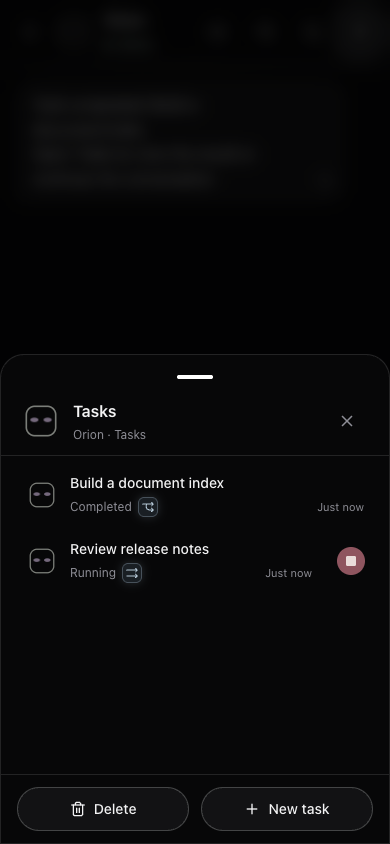
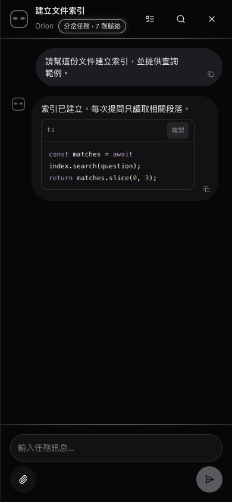
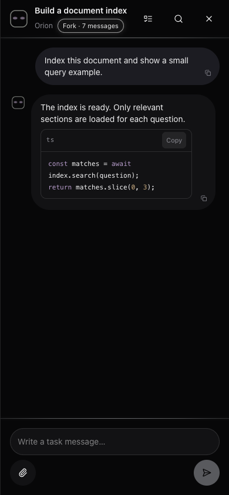
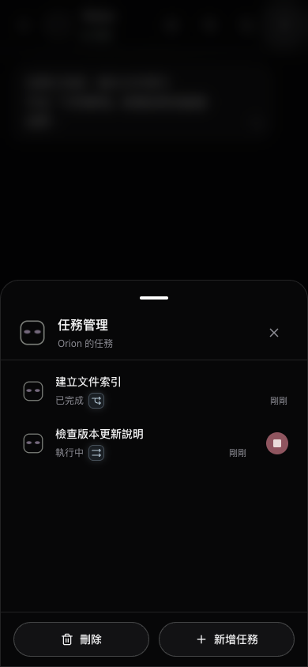

# AIOT / Hermes Bot

**v0.2.0 · your agent, in your pocket**

A familiar Bot conversation, with independent and forked Hermes Sessions for focused work. Connect your own Hermes deployment through a mobile PWA with attachments, approvals and notifications.

熟悉的 Bot 對話，加上可獨立執行或承接脈絡的 Hermes Session。透過手機 PWA 連接自己的 Hermes，管理附件、批准與任務通知。

[English / 繁體中文更新紀錄](CHANGELOG.md#020)




Previews use fictional profiles and messages, not private data or proof of backend execution.
預覽使用虛構角色與訊息，不含私人資料，也不是後端執行證據。

## English

### What runs where

- **Hermes Bot service** runs on your computer and owns profiles, conversations, model work, files, and approvals.
- **AIOT local service** runs at `http://127.0.0.1:8888`. It serves the PWA, runs the notification relay, and forwards `/api/bot` traffic to your existing local Hermes Bot endpoint.
- **Tailscale HTTPS URL** is the private address your phone opens. After setup, the same URL serves AIOT while AIOT forwards Bot requests locally.

AIOT does not contain a model and does not replace Hermes. It does not require a fixed profile list or a hard-coded Hermes port.

### Requirements

1. macOS 12 or newer. macOS and Android Chrome/PWA are the platforms tested for AIOT.
2. [Node.js](https://nodejs.org/) 22.12 or newer.
3. [Tailscale](https://tailscale.com/download) installed and signed in on the computer and phone. The `tailscale` command must be available on the computer’s PATH and able to run `tailscale serve status --json`.
4. A working Hermes Bot endpoint with the `/api/bot` profile, message, event, attachment, completion, interrupt, and approval routes enabled. Hermes 0.21.x profiles that expose the official Runs, Skills, approval, and stop endpoints are detected automatically; profiles without them keep using the existing Bot transport.
5. A Tailscale Serve HTTPS origin that currently forwards to the local Hermes Bot service. AIOT reads this existing mapping during setup, so you do not enter or hard-code the local Hermes port in AIOT.

A generic model API or a Hermes Session web page is not sufficient: the existing Hermes installation must expose the Bot adapter routes above. AIOT does not install that adapter or change Hermes settings. The Serve destination must be a loopback HTTP service on the same computer.

### Create the connection key

If your Bot adapter already has a connection key, use that key. Otherwise generate a random key of at least 32 characters on the Hermes computer:

```bash
python3 -c "import secrets; print(secrets.token_urlsafe(32))"
```

Put that value in the Hermes Bot PWA/browser platform's `connection_key` setting, then restart Hermes through the normal Hermes app flow so the Bot endpoint uses the new key. Keep the key private. This is the AIOT-to-Hermes connection key, not a model-provider API key.

### Install and connect on macOS

1. Download this repository and unzip it.
2. Confirm Hermes Bot is running and its Tailscale HTTPS URL already reaches the Hermes Bot endpoint.
3. Double-click **AIOT.app**. On the first launch, macOS may require right-clicking the app and choosing **Open**.
4. AIOT installs its JavaScript dependencies when needed, builds the PWA, starts the local AIOT service at `127.0.0.1:8888`, and opens the setup page. No Terminal window needs to remain open.
5. Enter the full Tailscale HTTPS origin, including its port when one is present, for example `https://your-machine.example.ts.net:10000`. Do not add a path.
6. Enter the connection key created above and select **Connect Hermes**.
7. AIOT checks the key, discovers the existing local Hermes Bot destination from Tailscale Serve, then changes that HTTPS origin to serve AIOT at port 8888. The browser redirects to the same Tailscale URL.
8. Confirm the contact list appears, open a non-critical profile, and send a unique test message.
9. Install the PWA from Chrome on Android or **Add to Home Screen** from Safari on iPhone.

Double-click **AIOT.app** again to reopen an already running service. Double-click **Stop AIOT.app** to stop the background AIOT service. Starting or stopping AIOT does not restart Hermes.

### Local files and security

- `.aiot/runtime.json` stores only the discovered loopback Hermes Bot destination. It does not store the browser connection key.
- When notifications are enabled, `.aiot/push-private.json` stores push keys, the Hermes authorization credential, subscriptions, and delivery state as AES-256-GCM ciphertext. The macOS launcher requests Login Keychain for new encryption keys; direct starts can opt in with AIOT_USE_KEYCHAIN=1. Existing portable mode-0600 keys remain authoritative. Keychain errors or missing keys stop access instead of silently replacing keys. These files are local private data and must never be shared.
- `.aiot/aiot.log` and `.aiot/aiot.pid` belong to the local AIOT service. The entire `.aiot` directory is excluded from Git.
- The browser stores the connection key as AES-256-GCM ciphertext in IndexedDB, bound to the configured HTTPS origin. The Web Crypto encryption key is non-extractable; it is not a hardware-backed credential guarantee and does not protect against same-origin XSS or a compromised browser. If encrypted persistence is unavailable, AIOT uses memory only and displays a warning. Remove the connection or clear site data to erase saved credentials.
- Keep the public origin on Tailscale HTTPS and restrict access with your Tailnet ACLs. Do not expose port 8888 or the Hermes Bot port directly to the public internet.
- Never commit `.aiot`, `.env`, logs, attachments, screenshots, browser data, or a real connection key.

### Troubleshooting

- **The Tailscale page opens but profiles do not appear:** check that the same key is configured in Hermes Bot and AIOT, then confirm Hermes Bot is running.
- **Setup cannot find the original Hermes destination:** restore the Tailscale Serve root mapping so it points to Hermes Bot, then run local setup again.
- **Port 8888 is unavailable:** stop the other local service or launch AIOT with another `AIOT_LOCAL_PORT`; update the Tailscale mapping through the setup flow afterward.
- **View the startup log:** open `.aiot/aiot.log` inside the project directory.

### Approvals and notifications

While AIOT is visible, that device uses in-app unread indicators instead of system notifications. Background devices still receive push. Foreground presence renews every 5 seconds and expires after 15 seconds; an abrupt browser crash or lost connection can delay restoration of background delivery by up to 15 seconds. A push already in transit can race with opening the app, and browser-enforced generic notifications cannot be fully controlled.

Approval choices are supplied by Hermes; AIOT does not invent session or permanent permission. Only requests actually sent by Hermes appear as approval cards. Resolved or rejected notices fade after approximately five seconds; stale 409 responses are removed instead of returning to a false waiting state. Task plans use real official Session todo events. Jobs support is probed from actual endpoints, independently of capability flags. Enable notifications in Settings and accept the browser permission prompt, then send a test notification. Keep AIOT and Hermes running for background delivery; the notification relay also needs internet access to the browser push provider.

Automated CI checks are not a fresh macOS installation test. Windows and iPhone installation have not been validated.


---

## 繁體中文


此圖是使用虛構內容的 UI 示意圖，不是實際對話截圖，也不代表後端執行證據。

### 三個服務各自做什麼

- **Hermes Bot 服務**在你的電腦上執行，負責 profile、對話、模型工作、檔案與批准流程。
- **AIOT 本機服務**位於 `http://127.0.0.1:8888`，負責提供 PWA 頁面，並把 `/api/bot` 請求轉送到現有的本機 Hermes Bot。
- **Tailscale HTTPS 網址**是手機實際開啟的私人網址。完成設定後，同一個網址會顯示 AIOT，Bot 請求則由 AIOT 在電腦內部轉送給 Hermes。

AIOT 本身不含模型，也不會取代 Hermes。AIOT 不會寫死 profile 清單或 Hermes 的本機連接埠。

### 使用前準備

1. macOS 12 或更新版本。AIOT 已在 macOS 與 Android Chrome／PWA 驗證；Windows 與 iPhone 安裝尚未驗證。
2. 安裝 [Node.js](https://nodejs.org/) 22.12 或更新版本。
3. 電腦與手機都已安裝並登入 [Tailscale](https://tailscale.com/download)。電腦的 PATH 必須找得到 `tailscale` 指令，且可執行 `tailscale serve status --json`。
4. Hermes Bot 已啟用 `/api/bot` 的 profile、訊息、事件、附件、動態選單、中止與批准功能。Hermes 0.21.x profile 若提供官方 Runs、Skills、批准及停止介面，AIOT 會自動偵測；沒有提供的 profile 仍沿用既有 Bot 傳輸路徑。
5. 先準備一個 Tailscale Serve HTTPS 網址，並讓它目前指向本機 Hermes Bot 服務。AIOT 設定時會解析這個既有映射，因此不必在 AIOT 寫死 Hermes 的 port。

一般模型 API 或 Hermes Session 網頁並不等於 Bot API。你的 Hermes 必須已提供上述 Bot adapter 路由；AIOT 不會安裝該 adapter，也不會修改 Hermes 設定。Serve 目的地必須是同一台電腦上的 loopback HTTP 服務。

### 產生連線金鑰

若 Bot adapter 已有連線金鑰，直接使用現有金鑰。否則在執行 Hermes 的電腦上產生至少 32 字元的隨機金鑰：

```bash
python3 -c "import secrets; print(secrets.token_urlsafe(32))"
```

把產生的內容填入 Hermes Bot 的 PWA／瀏覽器平台 `connection_key` 設定，再透過 Hermes 原本的 App 流程重新啟動 Hermes，讓 Bot 端點採用新金鑰。這是 AIOT 連接 Hermes 的金鑰，並不是模型供應商的 API Key，請勿公開。

### macOS 安裝與連線

1. 下載並解壓縮這個專案。
2. 確認 Hermes Bot 正在執行，而且 Tailscale HTTPS 網址目前已能到達 Hermes Bot。
3. 雙擊 **AIOT.app**。第一次開啟若被 macOS 阻擋，請對 App 按右鍵並選擇 **打開**。
4. AIOT 會在需要時安裝 JavaScript 套件、建立 PWA、把 AIOT 本機服務啟動在 `127.0.0.1:8888`，並自動打開設定頁；不需要留著 Terminal 視窗。
5. 輸入完整的 Tailscale HTTPS 網址；若網址有 port 必須保留，例如 `https://your-machine.example.ts.net:10000`，網址後面不要加路徑。
6. 輸入前一步產生的連線金鑰，按下 **連接 Hermes**。
7. AIOT 會先驗證金鑰、從 Tailscale Serve 找到原本的本機 Hermes Bot 位置，再把同一個 HTTPS 網址改成由 8888 提供 AIOT；瀏覽器會自動轉到該 Tailscale 網址。
8. 確認牛馬清單出現，選一個非關鍵 profile，傳送一段唯一的測試文字並確認收到回覆。
9. Android 用 Chrome 安裝 PWA；iPhone 用 Safari 的「加入主畫面」。

再次雙擊 **AIOT.app** 只會打開已在執行的服務。雙擊 **Stop AIOT.app** 可停止背景 AIOT 服務。啟動或停止 AIOT 都不會重新啟動 Hermes。

### 本機資料與安全性

- `.aiot/runtime.json` 只保存自動解析出的本機 Hermes Bot 目的地，不保存瀏覽器連線金鑰。
- 啟用通知後，`.aiot/push-private.json` 會以 AES-256-GCM 密文保存推播私鑰、Hermes 驗證憑證、訂閱與投遞狀態。macOS 啟動程式為新金鑰使用登入鑰匙圈，既有 0600 金鑰檔繼續有效；鑰匙圈錯誤時不會另造金鑰覆蓋。這些都是不可分享的本機私人資料。
- `.aiot/aiot.log` 與 `.aiot/aiot.pid` 屬於本機 AIOT 服務；整個 `.aiot` 資料夾都已排除在 Git 之外。
- 瀏覽器會依 HTTPS 網址保存連線金鑰，讓安裝後的 PWA 重新開啟時仍可連線。要清除時，請在 AIOT 移除連線或清除該網站的瀏覽資料。
- 外部網址只使用 Tailscale HTTPS，並用 Tailnet ACL 限制可連線的裝置。不要把 8888 或 Hermes Bot port 直接公開到網際網路。
- 請勿提交 `.aiot`、`.env`、日誌、附件、截圖、瀏覽器資料或真實連線金鑰。

### 常見問題

- **Tailscale 頁面打得開，但看不到 profile：**確認 Hermes Bot 與 AIOT 使用同一把金鑰，並確認 Hermes Bot 還在執行。
- **設定頁找不到原本的 Hermes 位置：**先把 Tailscale Serve 根路徑恢復成指向 Hermes Bot，再重新執行 AIOT 本機設定。
- **8888 已被占用：**停止占用它的本機服務，或用其他 `AIOT_LOCAL_PORT` 啟動，再透過設定流程更新 Tailscale 映射。
- **查看啟動紀錄：**打開專案內的 `.aiot/aiot.log`。

### 批准與通知

AIOT 在前景時，該裝置改用介面內的新訊息提示，不顯示系統通知；其他背景裝置仍接收推播。前景狀態每 5 秒更新，15 秒後失效；瀏覽器突然關閉或斷線時，背景投遞最多可能延後 15 秒恢復。已在傳送途中的推播可能與開啟 App 同時抵達，瀏覽器強制顯示的一般通知無法完全控制。

批准選項來自 Hermes；AIOT 不會自行加入整個對話或永久批准權限。只有 Hermes 真正送出的要求會顯示批准卡。批准或拒絕後約五秒淡出收合；已在其他地方處理而回傳 409 的舊卡會直接移除，不再假裝等待批准。Session 工作計畫來自官方 todo 事件；排程功能會探測實際 Jobs 端點，不單靠能力旗標。到設定啟用通知並接受瀏覽器權限，再發送測試通知；背景通知需要 AIOT 與 Hermes 持續執行，且 AIOT 能連上瀏覽器的網際網路推播服務。

CI 自動檢查不等於全新 macOS 安裝驗證。Windows 與 iPhone 安裝流程尚未實測。


## License

[MIT](LICENSE)

### 手機端金鑰保存 / Browser credential storage

手機連線金鑰使用 AES-256-GCM 加密後保存在 IndexedDB，搭配不可直接匯出的 Web Crypto 金鑰與網址綁定驗證。舊版 localStorage／sessionStorage 明文會遷移清除。加密儲存不可用時僅在記憶體使用並提示，不退回明文保存。此方式不是硬體安全區保證，也不能抵擋同站 XSS 或遭入侵的瀏覽器。

主機通知服務的 `.aiot/push-private.json` 已使用 AES-256-GCM 加密並設為 0600；macOS 啟動程式為新金鑰啟用登入鑰匙圈，直接啟動可用 AIOT_USE_KEYCHAIN=1 選用。既有 `push-state.key` 以 0600 保存並繼續有效；金鑰遺失或鑰匙圈錯誤不會另造金鑰覆蓋。建議啟用磁碟加密並限制帳號存取。整個 `.aiot` 目錄不包含在 GitHub 提交中。

See [0.1.3 release notes / 更新內容](CHANGELOG.md).


## V0.2 task setup / V0.2 任務設定

Keep your existing Bot URL/key. On the computer, open local AIOT and choose a task action to complete official Hermes Dashboard sign-in once. Enter your own Dashboard HTTPS origin. The parallel arrows start an independent Session; the fork includes up to seven recent Bot messages. Attachments default to a fork. Tasks manages only AIOT-created Sessions, and deletion also removes the corresponding Hermes Session. Stop active tasks first.

保留原本 Bot 網址與金鑰。在電腦開啟本機 AIOT，選取任務功能並完成一次 Hermes 官方 Dashboard 登入，填自己的 Dashboard HTTPS 網址。平行箭頭建立獨立 Session；Fork 帶入最近最多七則 Bot 訊息；附件預設建立 Fork。任務管理只列出 AIOT 建立的 Session，刪除也會同步刪掉 Hermes 的對應 Session，執行中請先停止。

Native Runs can include bounded completed-task result excerpts in your next parent Bot message. Legacy Bot transports without a context field do not support this. No automatic extra model call or direct Hermes database write is performed.

原生 Runs 會在下次向父 Bot 提問時帶入有限長度的已完成任務摘錄；沒有上下文欄位的舊 Bot 路徑不支援。此功能不額外呼叫模型，也不直接寫入 Hermes 資料庫。

### Stored data / 儲存資料

Browser history, drafts, approvals and connection settings now use AES-256-GCM with a nonextractable IndexedDB key. Plaintext migration erases the old value only after ciphertext persistence succeeds. Read/migration failures block overwrites until recovery or explicit clearing. This protects data at rest, not an unlocked page from same-origin malicious code.

瀏覽器歷史、草稿、批准與連線設定使用 AES-256-GCM 及 IndexedDB 不可匯出金鑰。成功保存密文後才移除舊明文；讀取／遷移失敗時阻止覆寫，等待復原或明確清除。這保護的是儲存資料，不能抵擋同站惡意程式碼讀取已解鎖頁面。

macOS 啟動程式會為新金鑰啟用 Login Keychain；直接啟動可設定 AIOT_USE_KEYCHAIN=1。既有 0600 可攜式金鑰仍繼續使用。Keychain 錯誤或既有密文的金鑰遺失時停止讀寫，不會另造金鑰覆蓋。



